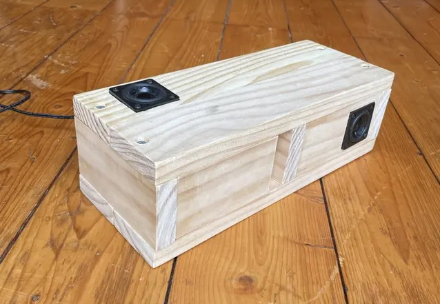

# ASA-BOX2

  

## description:

an update to asa-box1(2023). Run apache + Flask web server on local network. Controls PureData patches, modes, and parameters like volume using OSC. Main functionality the same as 2023, A soft noise wave-like white noise generation,and an FM piano ambient piece.

#### goals:

the web server will have an update button so more PD patches can be uploaded through git.

## materials:

- raspberry pi zero W
- dayton audio 1" speakers
- hifiBerry miniAmp 1.0

## basic ssh info:

- asa.local
- asa-admin
- secret password for login

## systemctl setup:

- asabox-web.service
-
